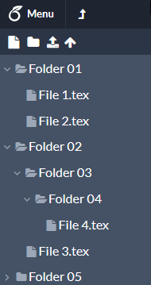

# Overleaf Collapse All Folders

## Description

Adds a button which allows collapsing all folders within the file viewer.

## Demo

## Installation

1. Install a userscript extension for your browser (e.g. [Tampermonkey](https://www.tampermonkey.net/))
2. Add the raw user.js here from GitHub.